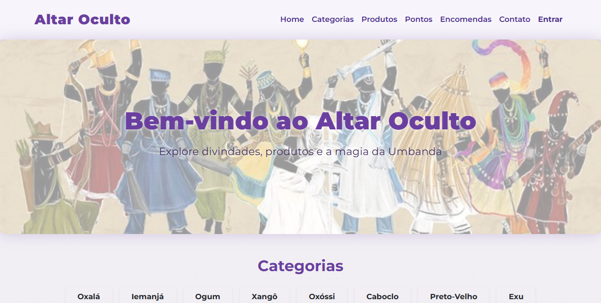
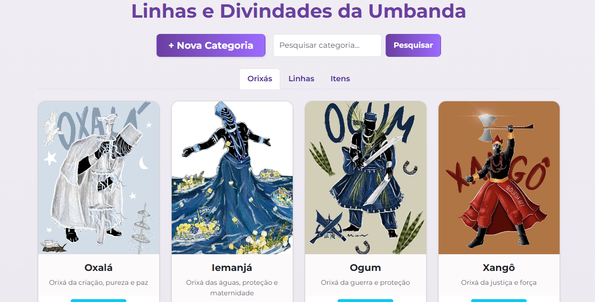

# 🕯️ Altar Oculto - Loja de Umbanda


---

# 📋 Sobre o Projeto

O **Altar Oculto** é um sistema de e-commerce desenvolvido para a disciplina de **Desenvolvimento de Aplicações Web** do **IFSC - Câmpus Chapecó**.

O projeto consiste em uma loja virtual especializada em artigos espirituais, com foco em produtos relacionados à **Umbanda e religiões de matriz africana**, permitindo:

- visualização de categorias;
- catálogo de produtos;
- informações espirituais;
- gerenciamento de estoque;
- cadastro de usuários;
- criação de encomendas;
- administração do sistema.

O sistema foi desenvolvido utilizando o framework **Laravel**, seguindo o padrão arquitetural **MVC**, aplicando:

- Programação Orientada a Objetos;
- Eloquent ORM;
- relacionamentos entre tabelas;
- migrations;
- seeders;
- autenticação de usuários.

---

# 📸 Créditos das Imagens

As imagens utilizadas nas categorias, produtos e elementos visuais possuem caráter **exclusivamente ilustrativo e acadêmico**.

Algumas imagens foram encontradas através do **Pinterest**, sendo seus direitos pertencentes aos respectivos autores, criadores ou proprietários originais.

Este projeto foi desenvolvido sem finalidade comercial, como parte de uma atividade acadêmica do **IFSC - Câmpus Chapecó**.

Caso algum proprietário solicite a remoção ou substituição de algum conteúdo visual, a alteração poderá ser realizada.

---

# 🖼️ Telas do Sistema

## 🏠 Página Inicial

Tela principal da loja contendo apresentação dos produtos e categorias.



---

## 🕯️ Categorias

Página de categorias espirituais cadastradas no sistema.




---

# 👤 Credenciais de Acesso

## 🔑 Administrador

Usuário responsável pelo gerenciamento do sistema.

Permissões:

- Gerenciar produtos;
- Gerenciar categorias;
- Visualizar usuários;
- Administrar encomendas;
- Acessar relatórios.


```

E-mail:
[admin@site.com](mailto:admin@site.com)

Senha:
admin123

```

---

## 👤 Cliente

Usuário comum da loja.

Permissões:

- Visualizar produtos;
- Realizar encomendas;
- Consultar pedidos.


```

E-mail:
[cliente@site.com](mailto:cliente@site.com)

Senha:
password

```

---

# 🚀 Funcionalidades

## 🛍️ Produtos

O sistema possui gerenciamento de produtos contendo:

- Nome;
- Descrição;
- Preço;
- Imagem;
- Categoria;
- Estoque;
- Código;
- Peso;
- Dimensões;
- Tags;
- Produto popular;
- Status ativo/inativo.

---

## 🕯️ Categorias

Cada categoria possui informações detalhadas:

- Nome;
- Descrição;
- História;
- Linha espiritual;
- Cores;
- Dia da semana;
- Símbolos;
- Saudação;
- Personalidade;
- Animais relacionados;
- Elementos;
- Datas importantes;
- Observações.

---

## 🛒 Encomendas

Sistema de pedidos contendo:

- Cliente;
- Email;
- Telefone;
- Endereço;
- Valor total;
- Observações;
- Status.

Status:

```

pendente
enviado
concluido

```

---

## 👥 Usuários

Cadastro de usuários contendo:

- Nome;
- Email;
- Senha;
- Imagem;
- Fornecedor relacionado.

Tipos de usuário:

```

Administrador
Cliente
Fornecedor

```

---

## 🎵 Pontos

Sistema de armazenamento de pontos espirituais:

- Nome;
- Tipo;
- Entidade;
- Função;
- Letra;
- Categoria relacionada;
- Áudio.

---

# 🗄️ Banco de Dados

Principais tabelas:

```

usuarios
categorias
produtos
encomendas
pontos
sessions
fornecedor_produto

```

---

## Relacionamentos

```

Categorias
|
| 1:N
|
Produtos

Usuários
|
| 1:N
|
Encomendas

Categorias
|
| 1:N
|
Pontos

Usuários
|
| N:N
|
Produtos

````

---

# 🛠️ Tecnologias Utilizadas

## Backend

- PHP 8.2+
- Laravel 11
- Eloquent ORM
- MySQL


## Frontend

- Blade
- HTML5
- CSS3
- Bootstrap
- JavaScript


## Ferramentas

- Composer
- NPM
- Git
- GitHub
- Visual Studio Code

---

# 📥 Como Executar o Projeto

## Pré-requisitos

Instale:

- PHP 8.2+
- Composer
- Node.js
- MySQL
- Git


Recomendado:

- Laravel Herd
- Laragon
- XAMPP

---

# 1️⃣ Clonar o projeto

```bash
git clone https://github.com/Ravemuon/altar-oculto-laravel.git
````

Acesse a pasta:

```bash
cd altar-oculto-laravel
```

---

# 2️⃣ Instalar dependências PHP

```bash
composer install
```

---

# 3️⃣ Instalar dependências Front-end

```bash
npm install
```

---

# 4️⃣ Criar arquivo .env

Linux/Mac:

```bash
cp .env.example .env
```

Windows:

```bash
copy .env.example .env
```

---

# 5️⃣ Gerar chave Laravel

```bash
php artisan key:generate
```

---

# 6️⃣ Configurar Banco de Dados

Abra:

```
.env
```

Configure:

```env
DB_CONNECTION=mysql
DB_HOST=127.0.0.1
DB_PORT=3306
DB_DATABASE=altar_oculto
DB_USERNAME=root
DB_PASSWORD=
```

Crie o banco:

```
altar_oculto
```

no MySQL.

---

# 7️⃣ Executar migrations

Criar tabelas:

```bash
php artisan migrate
```

---

# 8️⃣ Inserir dados iniciais

Executar seeders:

```bash
php artisan db:seed
```

ou recriar tudo:

```bash
php artisan migrate:fresh --seed
```

Os seeders criam:

* Usuários;
* Categorias;
* Produtos;
* Encomendas;
* Pontos.

---

# 9️⃣ Executar aplicação

Inicie o Laravel:

```bash
php artisan serve
```

Acesse:

```
http://127.0.0.1:8000
```

---

# Front-end

Para compilar arquivos CSS e JavaScript:

```bash
npm run dev
```

---

# 📂 Estrutura do Projeto

```
altar_oculto/

├── app/
│   ├── Models/
│   └── Http/
│       └── Controllers/
│

├── database/
│   ├── migrations/
│   └── seeders/
│

├── resources/
│   ├── views/
│   ├── css/
│   └── js/
│

├── public/

├── assets/
│   └── imagens/
│       ├── tela_inicial.png
│       └── tela_categorias.png

├── routes/
│   └── web.php

└── README.md
```

---

# 📌 Comandos Úteis

Limpar cache:

```bash
php artisan optimize:clear
```

---

Ver rotas:

```bash
php artisan route:list
```

---

Criar model:

```bash
php artisan make:model Nome
```

---

Criar controller:

```bash
php artisan make:controller NomeController
```

---

Criar migration:

```bash
php artisan make:migration nome_da_migration
```

---

Criar seeder:

```bash
php artisan make:seeder NomeSeeder
```

---

# 📜 Licença

Este projeto está licenciado sob a licença MIT.

---

# 🎓 Desenvolvimento

Projeto acadêmico desenvolvido para:

**IFSC - Instituto Federal de Santa Catarina**

**Câmpus Chapecó**

Disciplina:

**Desenvolvimento de Aplicações Web**

---

# 📌 Observação Final

Este projeto possui finalidade educacional e tem como objetivo demonstrar conhecimentos em:

* Desenvolvimento Web;
* Laravel;
* Banco de Dados Relacional;
* Arquitetura MVC;
* Sistemas de e-commerce;
* Organização profissional de projetos.

```
